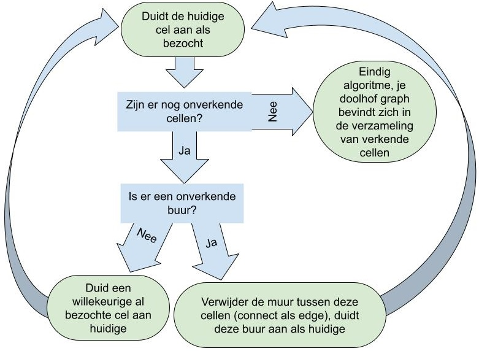
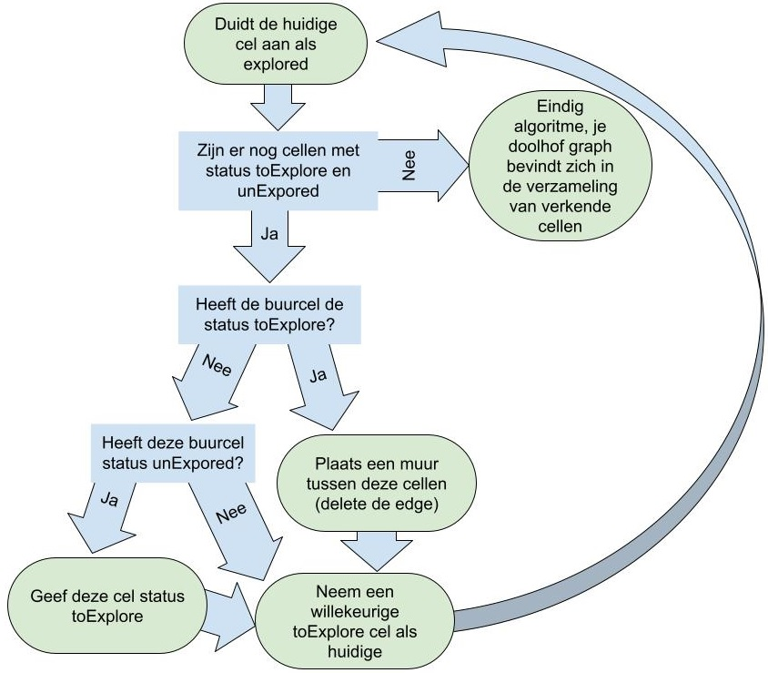
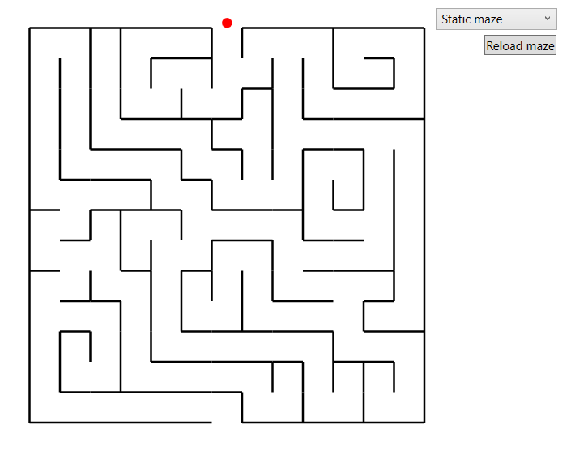
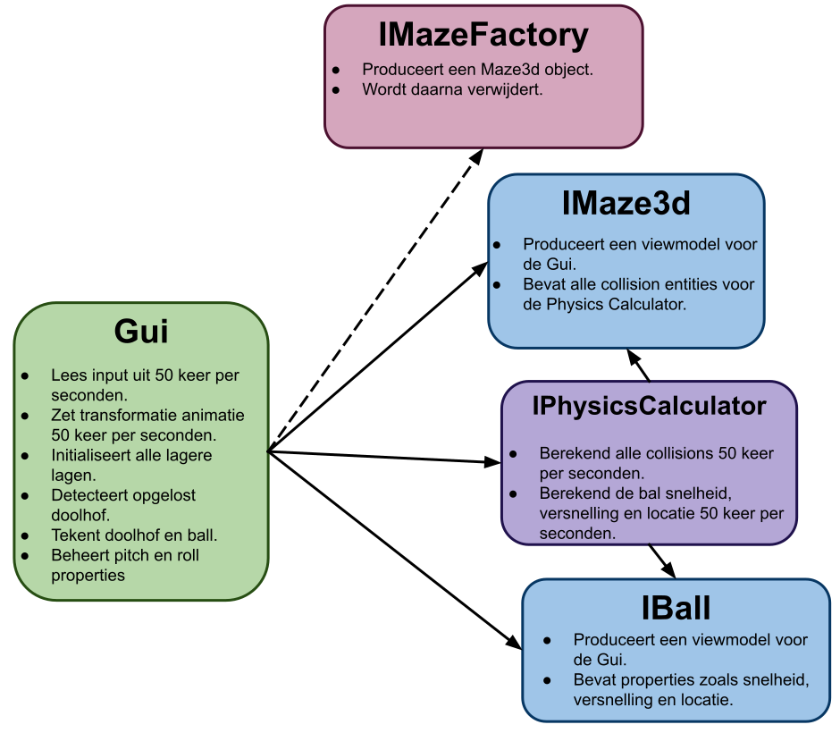
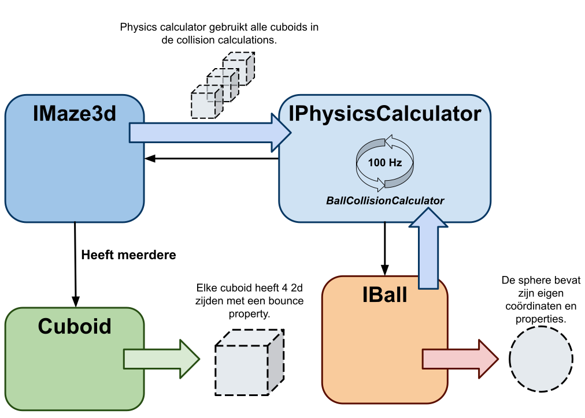
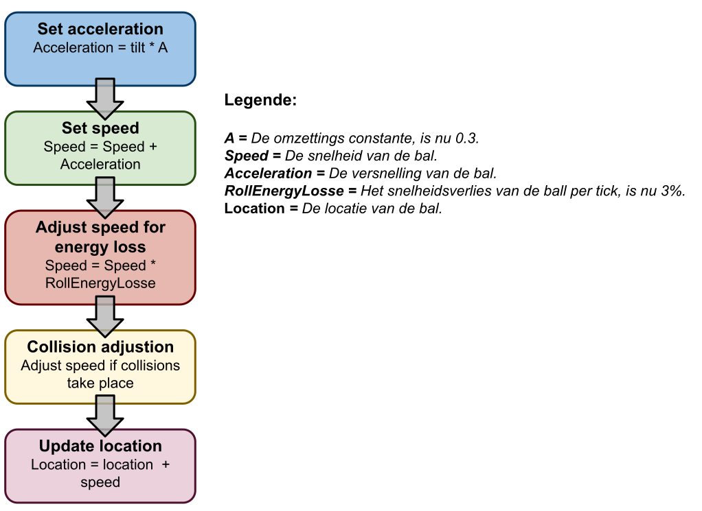
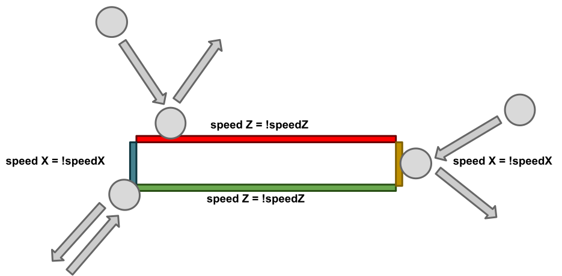
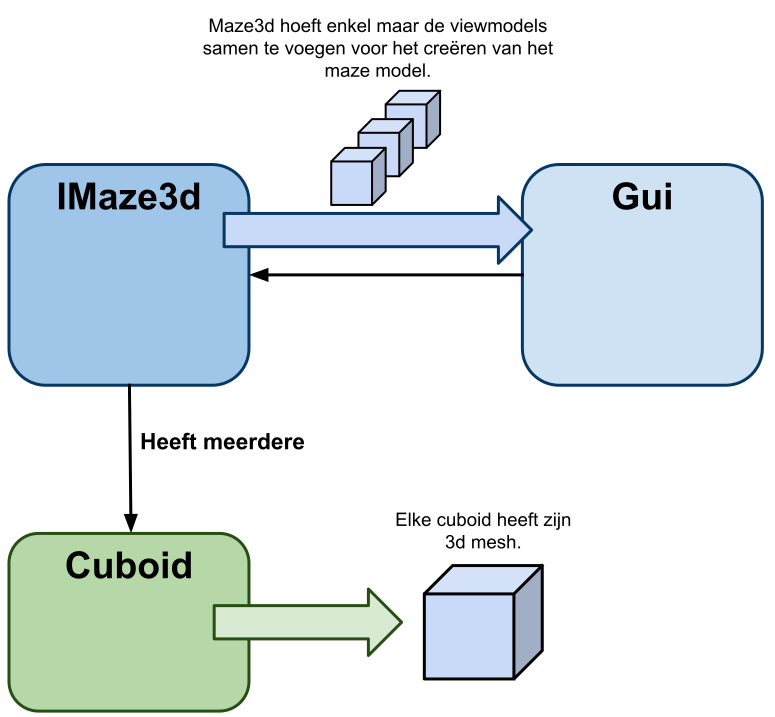
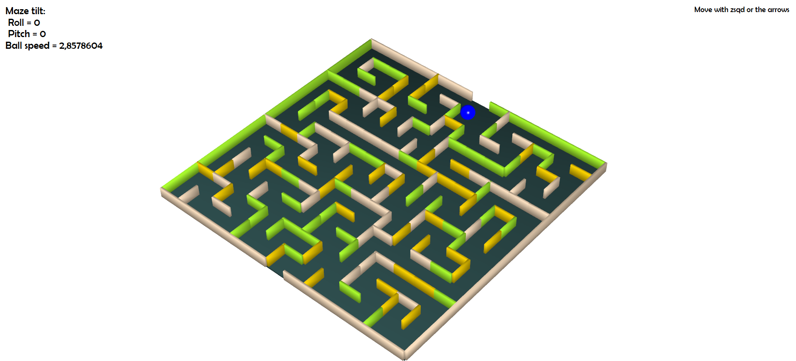

# 2324-AP-LeanderBaert

## Blok 1-2d doolhof generatie
### Structuur
Het 2e doolhofgeneratieprogramma bestaat uit 2 projecten:

- Maze2d, bevat de presentatielaag en de spelerklasse. Samengevat bevat dit project alle klassen die alleen deel uitmaken van het doolhofspel.
MazeGenerator, bevat logische klassen die verantwoordelijk zijn voor het genereren, opslaan en omzetten van mijn doolhof.
- De spelerklasse heb ik in het project Maze2d geplaatst omdat deze niets te maken heeft met het genereren van het doolhof. Hij is dus een onderdeel van het spel Maze2d.

### Modellen
#### Klassen van Project Maze2d:
- Klasse MainWindow in de presentatielaag. Deze klasse behandelt de GUI-logica en gebruikersinvoer. MainWindow maakt gebruik van 3 onderliggende klassen: Player, Maze en een van de MazeFactory-klassen. Deze bovenliggende klassen geven hun grafische gegevens door in de vorm van System.Windows.Shapes-objecten, zodat MainWindow ze direct kan tekenen.

- Klasse Player, deze klasse beheert de eigenschappen van de speler, zoals snelheid, uiterlijk en locatie. De locatie van de speler wordt hier ook elke keer berekend op basis van de gebruikersinvoer en botsingsobjecten.

#### Klassen van Project MazeGenerator:
- Klasse Maze. Deze klasse slaat elke muur van het doolhof op als een boolean. Wanneer deze muur aanwezig moet zijn, wordt dit opgeslagen als 'true', en wanneer een muur ontbreekt, als 'false'. Verder wordt deze data omgezet naar een lijst van System.Windows.Shapes-objecten. Deze data wordt vervolgens gebruikt door MainWindow om het doolhof te tekenen. De Maze-klasse kan ook geïnitialiseerd worden met een graaf.

- Klasse Node. De Node-klasse wordt altijd gebruikt als onderdeel van een graaf. Node bevat de datavelden 'Location' en 'Edges'. De variabele 'Location' wordt als ID gebruikt, en de lijst 'Edges' slaat alle knooppunten op die met dit knooppunt verbonden zijn.

- Statische klasse MazeProperties, hier worden alle eigenschappen van het doolhof opgeslagen, zoals de startlocatie, het aantal vakjes en de grootte van de vakjes. Op deze manier kan elke deel van de MazeGenerator dezelfde eigenschappen delen.

- Klasse StaticMazeFactory, in deze klasse worden alle doolhofmuren handmatig opgeslagen. Met deze gegevens kan deze klasse een doolhofobject aanmaken.

- Klassen AddiAlgoMazeFactory en SubtrAlgoMazeFactory, beide klassen genereren een graaf op verschillende manieren. Met deze graaf wordt een doolhofobject gecreëerd.

### Algoritmes
#### Wall subtraction algorithm
Dit algoritme wordt geïmplementeerd in de klasse SubtrAlgoMazeFactroy.

Zoals in de opgave was aangeraden is dit algorithm een variant van het Depth first search algoritme, de werking verloopt volgens deze simpele stappen.



#### Wall addition algorithm
Dit algoritme wordt geïmplementeerd in de klasse AddiAlgoMazeFactroy.
Het algoritme werkt op basis van 3 cel states: unExplored, toExplore en explored. Het onderstaande shema verduidelijkt de werking. 



In mijn zoektocht naar een oplossing voor dit probleem schreef ik de methode AllNodesAreReachable die controleert ofals elke node wel degelijk bereikbaar was. Via de basis van dit algoritme ben ik uiteindlijk op de oplossing gekomen.
```csharp
public bool AllNodesAreReachable(List<Node> inputNodes)
{
    int totalNodeCount = inputNodes.Count;
    Queue<Node> exploreNext = new Queue<Node>(); //All nodes of whose neighbors will be checkt
    List<Node> approvedNode = new List<Node> { BeginningNode }; //All nodes that are reachble
    exploreNext.Enqueue(BeginningNode);

    while (exploreNext.Count > 0)
    {
        List<Node> neigbourNodes = new List<Node>();
        Node currentNode = exploreNext.Dequeue();
        foreach (Node neigbourNode in inputNodes.Where(node => currentNode.Edges.Any(currentNode => currentNode.Location == node.Location)))
        {
            neigbourNodes.Add(neigbourNode);
        }

        foreach (Node neighborNode in neigbourNodes.Where(node1 => !approvedNode.Any(node2 => node2.Location == node1.Location)))
        {
            exploreNext.Enqueue(neighborNode);
            approvedNode.Add(neighborNode);
        }
    }
    return approvedNode.Count == totalNodeCount;
}
```

Voor bijde algoritmes gebruikte ik een recursieve methode. Ik voorkoos dit boven een meer iteratieve oplossing omdat de code zo overzichtelijker blijft.

### Grafische applicatie

De grafische applicatie heb ik zeer simpel gehouden, hij bestaat maar uit 4 elementen.
Eerst een basis canvas die de andere elementen bevat, een comboBox voor de mazeFactory to selecteren en een refreshbutton om een nieuw maze te creëren. Ten laatste een canvas genoemt renderCanvas, hier wordt het maze op getekend.



### Algemene bedenkingen

Moest ik deze opdracht opnieuw maken zou ik:

- De nodes in een appart object "Graph" opslaan. Dit object zou de hulper methodes bevatten zoals: AddEdgesToNode, GetEdgesFromNode and remove edge. Dit zou de code alsvast stukken overzichterlijk maken.

- Gebruik maken van een grid in wpf, zo hoef ik niet elke muur appart de berekenen en tekenen.

## Blok 2-WPF 3D Game
### Structuur

De basis van mijn programma bestaat uit de samenwerking van 5 verschillende klassen:
- De GUI- Dit is de hoogste laag en is verantwoordelijk voor de user input en de visueele output. Functioneerd aan een tickrate van 50 Hz.
- IBall- De speler fysica entity, dit object genereert zijn visueel voorstelling en houd de zijn fysieke eigenschappen bij (x, y, z, snelheid, ...).
- IPhysicsCalculator- Berekend de collisions en update de Ball locatie aan een tickrate van 100 Hz.
- IMaze3d- Genereert de visueel voorstelling van het doolhof en produseert de gepaste collisions entitys hiervan.
- IMazeFactory- Produceert het Maze3d object.



### De aanpassingen aan bestaande code

Enkel de factories klassen van blok1 moesten een kleine aanpassing ondergaan.
De klasse Maze3d is een extensie van de klasse Maze2d. Hiervoor heb ik de factory klasses aangepast zodat deze ook Maze3d objecten kan produceren. 
```csharp
    public IMaze Maze2d => new Maze(CreateMazeGraph(), MazeStartEdge);
    public IMaze3d Maze3d => new Maze3d(CreateMazeGraph(), MazeStartEdge);
```

Daarnaast heb ik ook de start loctie van de factory klassen instelbaar gemaakt. De beste locatie van het doolhof verschilt tussen de 2d en 3d versies.
```csharp
    public SubtrAlgoMazeFactroy(Point MazeStartEdge)
    {
        this.MazeStartEdge = MazeStartEdge;
    }
```

### Fysica
#### Collision function


De fysica berekeningen van de bal gebeuren in 2d aangezien de bal toch niet in de hoogte hoeft de bewegen. Dit maakte de wiskundige berekeningen tientallen keren gemakelijker terwijl dit voor de gebruiker geen verschil uitmaakt.
In de kern van het de collision detectie functie is de methode CirkelOverlapsLine. Deze methode berekend simpelweg wanneer een zijde van een collision entity contact maakt met de bal.
```csharp
    private bool CirkelOverlapsLine(float x1, float y1, float x2, float y2, float xc, float yc, float straal)
    {
        /*Bron -->
        Java OO programming eind project
        class --> Meetkunde
        */

        float A = xc - x1;
        float B = yc - y1;
        float C = x2 - x1;
        float D = y2 - y1;

        float dot = A * C + B * D;
        float len_sq = C * C + D * D;
        float param = -1;
        if (len_sq != 0) //in case of 0 length line
            param = dot / len_sq;

        float xx, yy;

        if (param < 0)
        {
            xx = x1;
            yy = y1;
        }
        else if (param > 1)
        {
            xx = x2;
            yy = y2;
        }
        else
        {
            xx = x1 + param * C;
            yy = y1 + param * D;
        }

        float dx = xc - xx;
        float dy = yc - yy;

        return dx * dx + dy * dy <= Math.Pow(straal, 2);
    }
```

#### Fysica berekingen
In onderstaande diagram worden alle wiskundige stappen beschreven die ik gebruik om de bal fysica te realiseren.
<div style="text-align: center;">
    
</div>

#### Bounce calculation
Na het detecteren van een collision pas ik de snelheid aan van de bal. Dit realiseerde ik via bounce properties. Elke cuboid heeft 4 tweedimensionale zijden met elk zijn eigen vooringestelde bounce properties. Deze properties bepalen de ball snelheid en richting. 


```csharp
public Dictionary<CuboidSide, Line> CollisionLine => new Dictionary<CuboidSide, Line>()
{
    {CuboidSide.Front, new Line() {X1 = X, Y1 = Z, X2 = X + Width, Y2 = Z}},                 //Front side
    {CuboidSide.Back, new Line() {X1 = X, Y1 = Z + Depth, X2 = X + Width, Y2 = Z + Depth}},  //Back side
    {CuboidSide.Left, new Line() {X1 = X, Y1 = Z , X2 = X , Y2 = Z + Depth}},               //Left side
    {CuboidSide.Right, new Line() {X1 = X + Width, Y1 = Z, X2 = X + Width, Y2 = Z + Depth}} //Right side
};
```

### 3D model
#### Creatie doolhof viewmodel


De creatie van het doolhof viewmodel gebeurt in volgende stappen:
1. Produceer een Maze3d object. Via een van de mazefactorys wordt er een Maze3d object gecrieerd in de Gui. Het Maze3d object zal alle cuboid objecten genereren die nodig zijn om het doolhof te tekeken.
2. De cuboid initialisatie. Een cuboid is een driedimensionele geometrische vorm, het steld de muur voor van het doolhof. Dit object bevat alle properties zoals x, y, z, width en lenght die hij ontvangt van bovenliggende klasse Maze3d. Met onderstaande code genereert de cuboid dan zijn eigen 3d mesh.
```csharp
public GeometryModel3D GetWallGeometry => new GeometryModel3D
{
    /*Bron -->
    Bardai
    url --> https://g.co/bard/share/5becbe507d9d
    */

    Geometry = new MeshGeometry3D
    {
        Positions = new Point3DCollection
        {
                new Point3D(X, Y, Z),
                new Point3D(X + Width, Y, Z),
                new Point3D(X + Width, Y + Height, Z),
                new Point3D(X, Y + Height, Z),
                new Point3D(X, Y, Z + Depth),
                new Point3D(X + Width, Y, Z + Depth),
                new Point3D(X + Width, Y + Height, Z + Depth),
                new Point3D(X, Y + Height, Z + Depth),
        },
        TriangleIndices = new Int32Collection
        {
                // Front face
                0, 2, 1,
                0, 3, 2, 
                // Back face
                4, 5, 6,
                4, 6, 7, 
                // Left face
                0, 1, 5,
                0, 5, 4, 
                // Right face
                1, 2, 6,
                1, 6, 5,
                // Top face
                2, 3, 7,
                2, 7, 6, 
                // Bottom face
                3, 0, 4,
                3, 4, 7
        }
    },
    Material = new DiffuseMaterial(new SolidColorBrush(Color)),
};
```
Voor deze code gebruikte ik [Bron](https://g.co/bard/share/5becbe507d9d) als inspiratie. Deze voorbeeldcode genereerd een kubus, met wat kleine aanpassingen kan deze al rap een balk genereren.

3. Creatie ModelVisual3D. Als laatste stap wordt in Maze3d elke cuboid ModelVisual3D aan een Model3DGroup. Deze wordt dan omgezet naar ModelVisual3D.

### Grafische weergaven

De grafische applicatie is relatief simpel. De enige controle die de gerbuiker heeft is via de "zqsd" knoppen of via de pijltjes. Verder is er een weergave van de pitch en roll waarden, om de visueele waarneming te ondersteunen.


